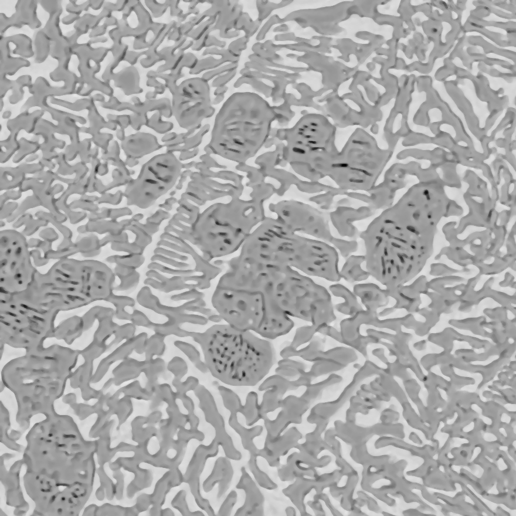
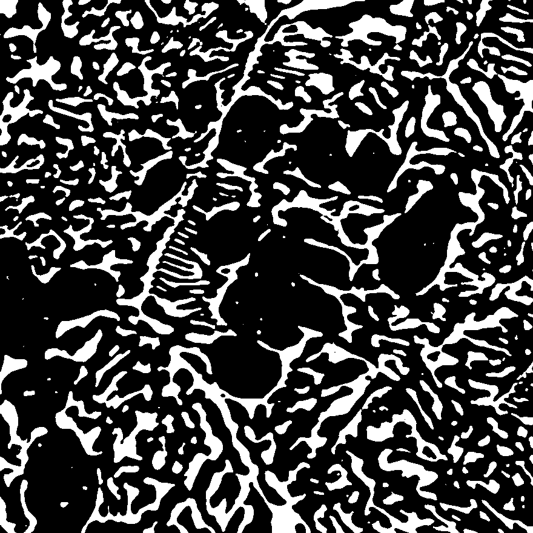

# SliceGAN用の画像前処理

最終更新: 2026-08 ／ 対象: SliceGAN（本家 stke9/SliceGAN）

SliceGANは、2次元の断面画像から3次元構造を生成する敵対的生成ネットワーク（GAN）です。材料組織のSEM画像などから、3次元的な組織モデルを再構成できます。

このページでは、学習に用いる画像の前処理（ImageJでの二値化）から、学習と3次元画像の生成までの流れをまとめます。

- 本家リポジトリ: [stke9/SliceGAN](https://github.com/stke9/SliceGAN)

> **注意**: 生成される3次元画像のTIFFファイルは、そのままではImageJで開けません。対処は「[5. 生成画像をImageJで開けるようにする](#5-生成画像をimagejで開けるようにする)」を参照してください。

---

## 1. 画像の前処理（ImageJ）

### 手順

1. ImageJで画像を開く
2. **Image → Type → 8-bit** でグレースケールに変換する
3. スケールバーを計測し、「µm/pixel」を確認する
4. **Analyze → Set Scale** でスケールを設定する
5. **Rectangle tool** で正方形の領域を選択する（`Shift` キーを押しながらドラッグすると正方形になります。ここでは880×880 pixels、左上を原点とします）
6. **Image → Crop** で切り出す



7. **Process → Filters → Median** でノイズを除去する（半径は倍率に応じて調整します。例: ×1000で3.0 pixels、×300で1.3 pixels）
8. **Image → Adjust → Threshold** で二値化する
   - **Dark background** にチェックを入れる
   - **Stack histogram**、**Don't reset range**、**Raw values** はチェックを外す
   - スライダで閾値を調整し、**Apply** を押す



9. **File → Save As → Tiff** で保存する

> **閾値の決め方**: 自動設定（Auto）で組織が適切に分離できればそれで構いません。うまく分離しない場合は手動で調整します。**同一の実験シリーズでは、試料間で条件を揃えるために同じ閾値を用いるか、少なくとも設定値を記録しておいてください。**

---

## 2. 組織の定量解析（ImageJ、必要に応じて）

二値化した画像から、粒径や形状のパラメータを算出できます。

**Analyze → Set Measurements** で以下を選択します。

- Area（面積）
- Centroid（重心）
- Perimeter（周囲長）
- Fit ellipse（楕円近似）
- Shape descriptors（Circularity、Aspect ratio、Roundness）
- Area fraction（面積率）

**Analyze → Analyze Particles** を実行します。

| 項目 | 設定 |
|---|---|
| Size | 0-Infinity |
| Circularity | 0.0-1.0 |
| Show | Outlines |
| Display results | ✓ |
| Clear results | ✓ |
| その他（Summarize、Add to Manager、Exclude on edges、Include holes、Overlay、Composite ROIs） | 未チェック |

結果（CSVファイル）と輪郭画像を保存します。

---

## 3. SliceGANの準備

本家リポジトリを取得します。

```
git clone https://github.com/stke9/SliceGAN.git
cd SliceGAN
```

前処理した画像を `Examples/` 以下に配置します。

```
Examples/XX/XXXXX.tif
```

### 実行スクリプトの編集

`run_slicegan_64model.py`（通常解像度）または `run_slicegan_128model.py`（高解像度）を開き、以下を自分の設定に合わせて書き換えます。

| 変数 | 内容 | 例 |
|---|---|---|
| `Project_name` | プロジェクト名 | `'MySample_64'` |
| `Project_dir` | 出力先ディレクトリ | `'Trained_Generators/MyProject'` |
| `image_type` | 画像の種類 | `'nphase'` |
| `img_channels` | 相の数（n-phaseの場合） | `2` |
| `data_type` | 入力データの形式 | `'tif2D'` |
| `data_path` | 入力画像のパス | `['Examples/XX/XXXXX.tif']` |

> **`image_type` の値に注意**: 二値化した組織画像を扱う場合は **`'nphase'`** です（`'n-phase'` ではありません）。ハイフンを入れた値でも現状は動作しますが、これはコード内の条件分岐がたまたま既定の分岐に落ちるためで、意図した指定ではありません。

---

## 4. 学習と生成

### 学習する

第2引数に `1` を渡すと学習が始まります。**拡張子 `.py` を忘れないでください。**

```
python run_slicegan_64model.py 1      # 通常解像度
python run_slicegan_128model.py 1     # 高解像度
```

学習には時間がかかります。SSH接続で実行する場合は `tmux` の利用をおすすめします（[計算サーバへの接続方法](../Server_setting/Howtoaccess_server/README.md)を参照）。

### 3次元画像を生成する

学習済みモデルから3次元画像を生成する場合は、第2引数に `0` を渡します。

```
python run_slicegan_64model.py 0
python run_slicegan_128model.py 0
```

`Project_dir`/`Project_name` 以下に、3次元構造のTIFFファイルが出力されます。

---

## 5. 生成画像をImageJで開けるようにする

### 何が起きるか

SliceGANが出力するTIFFファイルは、画素値が **64ビット整数（int64）** で書き込まれます。**ImageJは64ビット整数のTIFFを開けないため、そのままでは可視化できません。** ファイルサイズも必要以上に大きくなります。

画素値自体は0〜255の範囲に収まっているため、8ビット（uint8）に変換しても情報は失われません。

### 変換する

本家のコードは変更せず、生成後に以下のスクリプトで変換します。以下を `to_uint8.py` として保存してください。

```python
import sys
import numpy as np
import tifffile

if len(sys.argv) < 2:
    print("使い方: python to_uint8.py 入力ファイル.tif [出力ファイル.tif]")
    sys.exit(1)

src = sys.argv[1]
dst = sys.argv[2] if len(sys.argv) > 2 else src.replace(".tif", "_uint8.tif")

img = tifffile.imread(src)
print("変換前:", img.dtype, img.shape, "範囲:", img.min(), "-", img.max())

if img.min() < 0 or img.max() > 255:
    print("警告: 画素値が0-255の範囲外です。変換すると情報が失われます。")

tifffile.imwrite(dst, img.astype(np.uint8))
print("変換後:", tifffile.imread(dst).dtype, "->", dst)
```

実行します。

```
python to_uint8.py 生成された3次元画像.tif
```

`*_uint8.tif` が出力されるので、これをImageJやOVITOで開いてください。

> `tifffile` は以下で導入できます（[Pythonの環境構築](../Setting_WSL/Python_installation2/README.md)を参照）。
>
> ```
> conda install tifffile
> ```

---

## 関連ページ

- [OVITOの使い方メモ](../LAMMPS/OVITO_tips/README.md) — 3次元データの可視化
- [Pythonの環境構築（Miniforge）](../Setting_WSL/Python_installation2/README.md)
